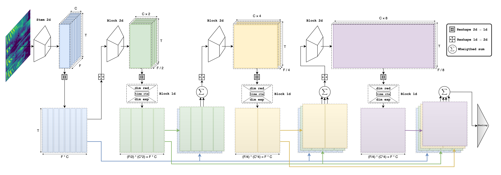

# ReDimNet

This is an official implementation of a neural network architecture presented in the paper [Reshape Dimensions Network for Speaker Recognition](https://arxiv.org/pdf/2407.18223).

<p align="center">
	
	<p align="center">
		<em>Speaker Recognition NN architectures comparison (2024)</em>
	</p>
</p>

## Update

* 2024.11.13 Refactored model's code. Added first pretrained models on `voxblink2` dataset, for more info please refer to [evaluation](EVALUATION.md) page.
* 2024.07.15 Adding model builder and pretrained weights for: `b0`, `b1`, `b2`, `b3`, `b5`, `b6` model sizes.

## Introduction

We introduce Reshape Dimensions Network (ReDimNet), a novel neural network architecture for spectrogram (audio) processing, specifically for extracting utterance-level speaker representations. ReDimNet reshapes dimensionality between 2D feature maps and 1D signal representations, enabling the integration of 1D and 2D blocks within a single model. This architecture maintains the volume of channel-timestep-frequency outputs across both 1D and 2D blocks, ensuring efficient aggregation of residual feature maps. ReDimNet scales across various model sizes, from 1 to 15 million parameters and 0.5 to 20 GMACs. Our experiments show that ReDimNet achieves state-of-the-art performance in speaker recognition while reducing computational complexity and model size compared to existing systems. 

<p align="center">
	
	<p align="center">
		<em>ReDimNet architecture</em>
	</p>
</p>

## Usage

### Requirements
PyTorch>=2.0

### Examples

#### Model load example
```python
import torch

# To load pretrained on vox2 model without Large-Margin finetuning
model = torch.hub.load('IDRnD/ReDimNet', 'ReDimNet', model_name='b2', train_type='ptn', dataset='vox2')

# To load pretrained on vox2 model with Large-Margin finetuning
model = torch.hub.load('IDRnD/ReDimNet', 'ReDimNet', model_name='b2', train_type='ft_lm', dataset='vox2')
```
For full list of pretrained models, please refer to [evaluation](EVALUATION.md)

#### Model inference example
> NOTE: model input is a 1-channel 16 kHz audio signal
```python
import torch
import torchaudio

# Load audio samples
samples, fs = torchaudio.load("assets/audio.wav")  # shape [1, T]
assert fs == 16000, f"Audio sampling rate {fs} != 16000"
assert samples.shape[0] == 1, f"Expected mono audio, but got {samples.shape[0]} channels"

# Load model pretrained and fine-tuned on vox2, voxblink2 and cn-celeb datasets
model = torch.hub.load(
	"IDRnD/ReDimNet",
	"ReDimNet",
	model_name="M",
	train_type="ft_mix",
	dataset="vb2+vox2+cnc"
)

# Select device and setup inference precision (AMP for GPU)
device_type = "cuda" if torch.cuda.is_available() else "cpu"
print(f"Using device: {device_type}")
device = torch.device(device_type)
precision = torch.float16 if device_type == "cuda" else torch.float32

# Setup model evaluation mode
model = model.to(device)
model.eval()

with torch.no_grad(), torch.autocast(device_type=device_type, dtype=precision):
    # Model input is [N, T], where N - batch size, T - samples length
    embedding = model(samples.to(device))
    print(
        embedding.shape, embedding.dtype
    )  # output shape is [N, 192], where 192 - embedding dimension
```


## Citation

If you find our work helpful and you used this code in your research, please cite:
```
@inproceedings{yakovlev24_interspeech,
  title     = {Reshape Dimensions Network for Speaker Recognition},
  author    = {Ivan Yakovlev and Rostislav Makarov and Andrei Balykin and Pavel Malov and Anton Okhotnikov and Nikita Torgashov},
  year      = {2024},
  booktitle = {Interspeech 2024},
  pages     = {3235--3239},
  doi       = {10.21437/Interspeech.2024-2116},
}
```

## Acknowledgements

For model training we used [wespeaker](https://github.com/wenet-e2e/wespeaker/tree/master) pipeline.

Some of the layers we ported from [transformers](https://github.com/huggingface/transformers).
